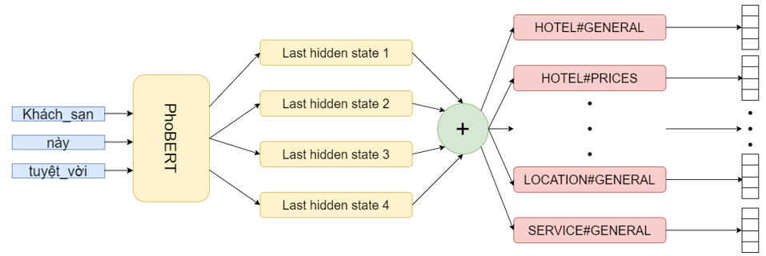

# Aspect-based Sentiment Analysis for Vietnamese

> Multi-task Solution for Aspect Category Sentiment Analysis (ACSA) on Vietnamese Datasets
- Demo: https://youtu.be/ggmAvpA4oHQ

## I. Introduction

This work aimed to solve the **Aspect-based Sentiment Analysis** (ABSA) problem for Vietnamese. Specifically, we focus on 2 sub-tasks of the **Aspect Category Sentiment Analysis** (ACSA):

1. **Aspect Category Detection** (ACD): Detect **`Aspect#Category`** pairs in each review (e.g., `HOTEL#CLEANLINESS`, `RESTAURANT#PRICES`, `SERVICE#GENERAL`, etc.)
2. **Sentiment Polarity Classification** (SPC): Classify the Sentiment Polarity (`Positive`, `Negative`, `Neutral`) of each **`Aspect#Category`** pair.

Here, we proposed 2 End-to-End solutions ([ACSA-v1](#acsa-v1-multi-task-approach) and [ACSA-v2](#acsa-v2-multi-task-with-multi-branch-approach)), which used [PhoBERT](https://github.com/VinAIResearch/PhoBERT) as a Pre-trained language model for Vietnamese to handle the above tasks simultaneously on 2 domains of the [VLSP 2018 ABSA Dataset](#ii-vlsp-2018-aspect-based-sentiment-analysis-dataset): [Hotel](./datasets/vlsp2018_hotel/) and [Restaurant](./datasets/vlsp2018_restaurant/).

## II. [VLSP 2018 Aspect-based Sentiment Analysis Dataset](https://vlsp.org.vn/vlsp2018/eval/sa)

### 1. Dataset Overview

|   Domain   |  Dataset | No. Reviews | No. `Aspect`#<br>`Cate`,`Polarity` | Avg. Length | Vocab Size | No. words in `Test`/`Dev` not in `Training` set |
|:----------:|:--------:|:-------:|:-------:|:---------:|:---------:|:---------:|
|            | [Training](./datasets/vlsp2018_hotel/1-VLSP2018-SA-Hotel-train.txt) |  3,000  |  13,948 |     47    |   3,908   |     -     |
|    [**Hotel**](./datasets/vlsp2018_hotel/)   |    [Dev](./datasets/vlsp2018_hotel/2-VLSP2018-SA-Hotel-dev.txt)   |  2,000  |  7,111  |     23    |   2,745   |   1,059   |
|            |   [Test](./datasets/vlsp2018_hotel/3-VLSP2018-SA-Hotel-test.txt)   |   600   |  2,584  |     30    |   1,631   |    346    |
|            | [Training](./datasets/vlsp2018_restaurant/1-VLSP2018-SA-Restaurant-train.txt) |  2,961  |  9,034  |     54    |   5,168   |     -     |
| [**Restaurant**](./datasets/vlsp2018_restaurant/) |    [Dev](./datasets/vlsp2018_restaurant/2-VLSP2018-SA-Restaurant-dev.txt)   |  1,290  |  3,408  |     50    |   3,398   |   1,702   |
|            |   [Test](./datasets/vlsp2018_restaurant/3-VLSP2018-SA-Restaurant-test.txt)   |   500   |  2,419  |    163    |   3,375   |   1,729   |

- The [**Hotel**](./datasets/vlsp2018_hotel/) domain consists of **34** following **`Aspect#Category`** pairs:

```python
['FACILITIES#CLEANLINESS', 'FACILITIES#COMFORT', 'FACILITIES#DESIGN&FEATURES', 'FACILITIES#GENERAL', 'FACILITIES#MISCELLANEOUS', 'FACILITIES#PRICES', 'FACILITIES#QUALITY', 'FOOD&DRINKS#MISCELLANEOUS', 'FOOD&DRINKS#PRICES', 'FOOD&DRINKS#QUALITY', 'FOOD&DRINKS#STYLE&OPTIONS', 'HOTEL#CLEANLINESS', 'HOTEL#COMFORT', 'HOTEL#DESIGN&FEATURES', 'HOTEL#GENERAL', 'HOTEL#MISCELLANEOUS', 'HOTEL#PRICES', 'HOTEL#QUALITY', 'LOCATION#GENERAL', 'ROOMS#CLEANLINESS', 'ROOMS#COMFORT', 'ROOMS#DESIGN&FEATURES', 'ROOMS#GENERAL', 'ROOMS#MISCELLANEOUS', 'ROOMS#PRICES', 'ROOMS#QUALITY', 'ROOM_AMENITIES#CLEANLINESS', 'ROOM_AMENITIES#COMFORT', 'ROOM_AMENITIES#DESIGN&FEATURES', 'ROOM_AMENITIES#GENERAL', 'ROOM_AMENITIES#MISCELLANEOUS', 'ROOM_AMENITIES#PRICES', 'ROOM_AMENITIES#QUALITY', 'SERVICE#GENERAL']
```

- The [**Restaurant**](./datasets/vlsp2018_restaurant/) domain consists of **12** following **`Aspect#Category`** pairs:

```python
['AMBIENCE#GENERAL', 'DRINKS#PRICES', 'DRINKS#QUALITY', 'DRINKS#STYLE&OPTIONS', 'FOOD#PRICES', 'FOOD#QUALITY', 'FOOD#STYLE&OPTIONS', 'LOCATION#GENERAL', 'RESTAURANT#GENERAL', 'RESTAURANT#MISCELLANEOUS', 'RESTAURANT#PRICES', 'SERVICE#GENERAL']
```

### 2. Constructing `.csv` Files for [Model Development](#iv-model-development)

For models to easily process the dataset, I transformed the original `.txt` files into `.csv` form using the **VLSP2018Parser** class in [vlsp2018_processor.py](./processors/vlsp2018_processor.py). 
I already provided these `.csv` files for both domains in the [datasets](./datasets/) folder. However, if you want to re-generate them, you can run the following command

```bash
python processors/vlsp2018_processor.py
```

Each row in the `.csv` will contains review and their corresponding **`Aspect#Category,Polarity`** labels, with the value `1` demonstrating the existence of the **`Aspect#Category`** in the review associated with its `Positive` label, and the same for `2` and `3` for `Negative` and `Neutral` labels, respectively. Finally, the value `0` indicates that the **`Aspect#Category`** does not exist in the review.


## III. Preprocessing


👉 I already provided the preprocessed data in the [datasets](./datasets/) folder. 

I implemented **3** classes in the [vietnamese_preprocessor.py](./preprocessors/vietnamese_preprocessor.py) to preprocess raw Vietnamese text data. This is my improved version from the [work](https://github.com/behitek/text-classification-tutorial/blob/master/text_classification_tutorial.ipynb) by [behitek](https://github.com/behitek):

1. **VietnameseTextCleaner**: Simple regex-based text cleaning to remove HTML, Emoji, URL, Email, Phone Number, Hashtags, and other unnecessary characters.
2. **VietnameseToneNormalizer**: Normalize Unicode (eg., `'ờ' != 'ờ'`) and Sentence Typing (eg., `lựơng` => `lượng`, `thỏai mái` => `thoải mái`).
3. **VietnamesePreprocessor**: Combine the above 2 classes and add these following steps to the pipeline
    - [Teencode Normalization](https://gist.githubusercontent.com/behitek/7d9441c10b3c2739499fc5a4d9ea06fb/raw/df939245b3e841b62af115be4dcb3516dadc9fc5/teencode.txt)
    - [Vietnamese Error Correction](https://huggingface.co/bmd1905/vietnamese-correction-v2)
    - [Word Segmentation](https://github.com/vncorenlp/VnCoreNLP).

## IV. Model Development

Based on the original [BERT paper](https://arxiv.org/pdf/1810.04805), the model achieved the best results when concatenating the last 4 layers of BERT together. So we applied that method to our architectures in combination with 2 output construction ways.
 
### ACSA-v1. Multi-task Approach:

👉 Notebook Solutions: [Hotel-v1.ipynb](./experiments/Hotel-v1.ipynb), [Restaurant-v1.ipynb](./experiments/Restaurant-v1.ipynb)


We transformed each **`Aspect#Category`** pair and their corresponding `Polarity` labels in each dataset's review into a list of `C` one-hot vectors, where `C` is the number of **`Aspect#Category`** pairs. 

Each vector has **3** polarity labels, `Positive`, `Negative`, `Neutral`, and **1** `None` label to indicate whether or not the input has this **`Aspect#Category`** so that it can have a polarity. Labels that exists will be `1`, otherwise `0`.


### ACSA-v2. Multi-task with Multi-branch Approach:

👉 Notebook Solutions: [Hotel-v2.ipynb](./experiments/Hotel-v2.ipynb), [Restaurant-v2.ipynb](./experiments/Restaurant-v2.ipynb)



- The input is the same as [ACSA-v1 approach](#acsa-v1-multi-task-approach).
- Branching into many submodels by using `C` fully connected layers but not concatenating them into a single one.

## V. Experimental Results

```bash
source ./evaluators/vlsp_evaluate.sh
```

<table>
<thead>
  <tr>
    <th rowspan="2">Task</th>
    <th rowspan="2">Method</th>
    <th colspan="3">Hotel</th>
    <th colspan="3">Restaurant</th>
  </tr>
  <tr>
    <th>Precision</th>
    <th>Recall</th>
    <th>F1-score</th>
    <th>Precision</th>
    <th>Recall</th>
    <th>F1-score</th>
  </tr>
</thead>
<tbody>
  <tr>
    <td align="center" rowspan="5">Aspect<br>Detection</td>
    <td align="center">VLSP best submission</td>
    <td align="center">76.00</td>
    <td align="center">66.00</td>
    <td align="center">70.00</td>
    <td align="center">79.00</td>
    <td align="center">76.00</td>
    <td align="center">77.00</td>
  </tr>
  <tr>
    <td align="center">Bi-LSTM+CNN</td>
    <td align="center">84.03</td>
    <td align="center">72.52</td>
    <td align="center">77.85</td>
    <td align="center">82.02</td>
    <td align="center">77.51</td>
    <td align="center">79.70</td>
  </tr>
  <tr>
    <td align="center">BERT-based Hierarchical</td>
    <td align="center">-</td>
    <td align="center">-</td>
    <td align="center">82.06</td>
    <td align="center">-</td>
    <td align="center">-</td>
    <td align="center"><b>84.23</b></td>
  </tr>
  <tr>
    <td align="center">Multi-task</td>
    <td align="center"><b>87.45</b></td>
    <td align="center"><b>78.17</b></td>
    <td align="center"><b>82.55</b></td>
    <td align="center">81.09</td>
    <td align="center">85.61</td>
    <td align="center">83.29</td>
  </tr>
  <tr>
    <td align="center">Multi-task Multi-branch</td>
    <td align="center">63.21</td>
    <td align="center">57.86</td>
    <td align="center">60.42</td>
    <td align="center">80.81</td>
    <td align="center">87.39</td>
    <td align="center">83.97</td>
  </tr>
  <tr>
    <td align="center" rowspan="5">Aspect +<br>Polarity</td>
    <td align="center">VLSP best submission</td>
    <td align="center">66.00</td>
    <td align="center">57.00</td>
    <td align="center">61.00</td>
    <td align="center">62.00</td>
    <td align="center">60.00</td>
    <td align="center">61.00</td>
  </tr>
  <tr>
    <td align="center">Bi-LSTM+CNN</td>
    <td align="center">76.53</td>
    <td align="center">66.04</td>
    <td align="center">70.90</td>
    <td align="center">66.66</td>
    <td align="center">63.00</td>
    <td align="center">64.78</td>
  </tr>
  <tr>
    <td align="center">BERT-based Hierarchical</td>
    <td align="center">-</td>
    <td align="center">-</td>
    <td align="center">74.69</td>
    <td align="center">-</td>
    <td align="center">-</td>
    <td align="center">71.30</td>
  </tr>
  <tr>
    <td align="center">Multi-task</td>
    <td align="center"><b>81.90</b></td>
    <td align="center"><b>73.22</b></td>
    <td align="center"><b>77.32</b></td>
    <td align="center"><b>69.66</b></td>
    <td align="center"><b>73.54</b></td>
    <td align="center"><b>71.55</b></td>
  </tr>
  <tr>
    <td align="center">Multi-task Multi-branch</td>
    <td align="center">57.55</td>
    <td align="center">52.67</td>
    <td align="center">55.00</td>
    <td align="center">68.69</td>
    <td align="center">74.29</td>
    <td align="center">71.38</td>
  </tr>
</tbody>
</table>
