# Aspect-based Sentiment Analysis for Vietnamese

- Publication: https://ieeexplore.ieee.org/document/9865479
- Demo: https://youtu.be/ggmAvpA4oHQ

```bash
Enter your sentence: Lễ tân thân thiện, có thang máy, vị trí ks thuận tiện, view thành phố rất đẹp. Phòng sạch nhưng hơi nhỏ & thiếu bình đun siêu tốc. Sẽ quay lại & giới thiệu bạn bè
=> FACILITIES#DESIGN&FEATURES,positive
=> LOCATIONIGENERAL,positive
=> ROOM_AMENITIES#DESIGN&FEATURES,negative
=> ROOMS#CLEANLINESS,positive
=> ROOMS#DESIGN&FEATURES,negative
=> SERVICE#GENERAL,positive
```

## Table of Contents

- [I. Introduction](#i-introduction)
- [II. The VLSP 2018 Aspect-based Sentiment Analysis Dataset](#ii-the-vlsp-2018-aspect-based-sentiment-analysis-dataset)
  - [1. Dataset Overview](#1-dataset-overview)
  - [2. Constructing `*.csv` Files for Model Development](#2-constructing-csv-files-for-model-development)
- [III. Vietnamese Preprocessing](#iii-vietnamese-preprocessing)
  - [1. Vietnamese Preprocessing Steps for the VLSP 2018 ABSA Dataset](#1-vietnamese-preprocessing-steps-for-the-vlsp-2018-absa-dataset)
  - [2. The vietnamese_processor.py](#2-the-vietnamese_processorpy)
- [IV. Model Development](#iv-model-development)
  - [ACSA-v1. Multi-task Approach](#acsa-v1-multi-task-approach)
    - [1. Output Construction](#1-output-construction)
    - [2. Why use **one-hot** encoding and **Softmax**?](#2-why-use-one-hot-encoding-and-softmax)
    - [3. Why concat each `Aspect#Category` into 1 Dense layer and apply `binary_crossentropy`?](#3-why-concat-each-aspectcategory-into-1-dense-layer-and-apply-binary_crossentropy)
  - [ACSA-v2. Multi-task with Multi-branch Approach](#acsa-v2-multi-task-with-multi-branch-approach)
- [V. Experimental Results](#v-experimental-results)
  - [1. Evaluation on the VLSP 2018 ABSA Dataset](#1-evaluation-on-the-vlsp-2018-absa-dataset)
  - [2. Some Notes about the Results](#2-some-notes-about-the-results)

## I. Introduction

This work aimed to solve the **Aspect-based Sentiment Analysis** (ABSA) problem for Vietnamese. Specifically, we focus on 2 sub-tasks of the **Aspect Category Sentiment Analysis** (ACSA):

1. **Aspect Category Detection** (ACD): Detect **`Aspect#Category`** pairs in each review (e.g., `HOTEL#CLEANLINESS`, `RESTAURANT#PRICES`, `SERVICE#GENERAL`, etc.)
2. **Sentiment Polarity Classification** (SPC): Classify the Sentiment Polarity (`Positive`, `Negative`, `Neutral`) of each **`Aspect#Category`** pair.

Here, we proposed 2 End-to-End solutions ([ACSA-v1](#acsa-v1-multi-task-approach) and [ACSA-v2](#acsa-v2-multi-task-with-multi-branch-approach)), which used [PhoBERT](https://github.com/VinAIResearch/PhoBERT) as a Pre-trained language model for Vietnamese to handle the above tasks simultaneously on 2 domains of the [VLSP 2018 ABSA Dataset](#ii-vlsp-2018-aspect-based-sentiment-analysis-dataset): [Hotel](./datasets/vlsp2018_hotel/) and [Restaurant](./datasets/vlsp2018_restaurant/).

## II. The [VLSP 2018 Aspect-based Sentiment Analysis Dataset](https://vlsp.org.vn/vlsp2018/eval/sa)

### 1. Dataset Overview

|   Domain   |  Dataset | No. Reviews | No. `Aspect`#<br>`Cate`,`Polarity` | Avg. Length | Vocab Size | No. words in `Test`/`Dev` not in `Training` set |
|:----------:|:--------:|:-------:|:-------:|:---------:|:---------:|:---------:|
|            | [Training](./datasets/vlsp2018_hotel/1-VLSP2018-SA-Hotel-train.txt) |  3,000  |  13,948 |     47    |   3,908   |     -     |
|    [**Hotel**](./datasets/vlsp2018_hotel/)   |    [Dev](./datasets/vlsp2018_hotel/2-VLSP2018-SA-Hotel-dev.txt)   |  2,000  |  7,111  |     23    |   2,745   |   1,059   |
|            |   [Test](./datasets/vlsp2018_hotel/3-VLSP2018-SA-Hotel-test.txt)   |   600   |  2,584  |     30    |   1,631   |    346    |
|            | [Training](./datasets/vlsp2018_restaurant/1-VLSP2018-SA-Restaurant-train.txt) |  2,961  |  9,034  |     54    |   5,168   |     -     |
| [**Restaurant**](./datasets/vlsp2018_restaurant/) |    [Dev](./datasets/vlsp2018_restaurant/2-VLSP2018-SA-Restaurant-dev.txt)   |  1,290  |  3,408  |     50    |   3,398   |   1,702   |
|            |   [Test](./datasets/vlsp2018_restaurant/3-VLSP2018-SA-Restaurant-test.txt)   |   500   |  2,419  |    163    |   3,375   |   1,729   |

- The [**Hotel**](./datasets/vlsp2018_hotel/) domain consists of **34** following **`Aspect#Category`** pairs:

```python
['FACILITIES#CLEANLINESS', 'FACILITIES#COMFORT', 'FACILITIES#DESIGN&FEATURES', 'FACILITIES#GENERAL', 'FACILITIES#MISCELLANEOUS', 'FACILITIES#PRICES', 'FACILITIES#QUALITY', 'FOOD&DRINKS#MISCELLANEOUS', 'FOOD&DRINKS#PRICES', 'FOOD&DRINKS#QUALITY', 'FOOD&DRINKS#STYLE&OPTIONS', 'HOTEL#CLEANLINESS', 'HOTEL#COMFORT', 'HOTEL#DESIGN&FEATURES', 'HOTEL#GENERAL', 'HOTEL#MISCELLANEOUS', 'HOTEL#PRICES', 'HOTEL#QUALITY', 'LOCATION#GENERAL', 'ROOMS#CLEANLINESS', 'ROOMS#COMFORT', 'ROOMS#DESIGN&FEATURES', 'ROOMS#GENERAL', 'ROOMS#MISCELLANEOUS', 'ROOMS#PRICES', 'ROOMS#QUALITY', 'ROOM_AMENITIES#CLEANLINESS', 'ROOM_AMENITIES#COMFORT', 'ROOM_AMENITIES#DESIGN&FEATURES', 'ROOM_AMENITIES#GENERAL', 'ROOM_AMENITIES#MISCELLANEOUS', 'ROOM_AMENITIES#PRICES', 'ROOM_AMENITIES#QUALITY', 'SERVICE#GENERAL']
```

- The [**Restaurant**](./datasets/vlsp2018_restaurant/) domain consists of **12** following **`Aspect#Category`** pairs:

```python
['AMBIENCE#GENERAL', 'DRINKS#PRICES', 'DRINKS#QUALITY', 'DRINKS#STYLE&OPTIONS', 'FOOD#PRICES', 'FOOD#QUALITY', 'FOOD#STYLE&OPTIONS', 'LOCATION#GENERAL', 'RESTAURANT#GENERAL', 'RESTAURANT#MISCELLANEOUS', 'RESTAURANT#PRICES', 'SERVICE#GENERAL']
```

### 2. Constructing `*.csv` Files for [Model Development](#iv-model-development)

For models to easily process the dataset, I transformed the original `*.txt` files into `*.csv` form using the **VLSP2018Parser** class in [vlsp2018_processor.py](./processors/vlsp2018_processor.py). 
I already provided these `*.csv` files for both domains in the [datasets](./datasets/) folder. However, if you want to re-generate them, you can run the following command

```bash
python processors/vlsp2018_processor.py
```

Each row in the `*.csv` will contains review and their corresponding **`Aspect#Category,Polarity`** labels, with the value `1` demonstrating the existence of the **`Aspect#Category`** in the review associated with its `Positive` label, and the same for `2` and `3` for `Negative` and `Neutral` labels, respectively. Finally, the value `0` indicates that the **`Aspect#Category`** does not exist in the review.


## III. Vietnamese Preprocessing


👉 I already provided the preprocessed data for this project in the [datasets](./datasets/) folder.

### 1. Vietnamese Preprocessing Steps for the [VLSP 2018 ABSA Dataset](#ii-vlsp-2018-aspect-based-sentiment-analysis-dataset)

```mermaid 
flowchart LR
    style A fill:#ffccff,stroke:#660066,stroke-width:2px;
    style B fill:#cceeff,stroke:#0066cc,stroke-width:2px;
    style C fill:#ccffcc,stroke:#009933,stroke-width:2px;
    style F fill:#ffcc99,stroke:#ff6600,stroke-width:2px;
    style G fill:#ccccff,stroke:#6600cc,stroke-width:2px;
    style H fill:#ccff99,stroke:#66cc00,stroke-width:2px;
    style I fill:#ffcccc,stroke:#cc0000,stroke-width:2px;

    A[/📄 Input Text/]
    B([🔠 Lowercase])

    subgraph C [VietnameseToneNormalizer]
        direction TB
        C1([🌀 Normalize\nUnicode])
        C2([🖋️ Normalize\nSentence Typing])
        C1 --> C2
    end  

    subgraph E [VietnameseTextCleaner]
        E1{{"<i class='fas fa-code'></i> Remove HTML"}}
        E2{{"<i class='far fa-smile'></i> Remove Emoji"}}
        E3{{"<i class='fas fa-link'></i> Remove URL"}}
        E4{{"<i class='far fa-envelope'></i> Remove Email"}}
        E5{{"<i class='fas fa-phone'></i> Remove Phone Number"}}
        E6{{"<i class='fas fa-hashtag'></i> Remove Hashtags"}}
        E7{{"<i class='fas fa-ban'></i> Remove Unnecessary Characters"}}
        E1 --> E2 --> E3 --> E4 --> E5 --> E6 --> E7 
    end

    F([💬 Normalize\nTeencode])
    G([🛠️ Correct\nVietnamese Errors])
    H([🔪 Word\nSegmentation])
    I[/📄 Preprocessed Text/]

    click G "https://huggingface.co/bmd1905/vietnamese-correction-v2"
    click H "https://github.com/vncorenlp/VnCoreNLP"
    
    A --> B --> C --> E --> E1
    E --> F --> G --> E 
    F --> H --> I
```



### 2. The [vietnamese_processor.py](./processors/vietnamese_processor.py)

I implemented **3** classes in the [vietnamese_processor.py](./processors/vietnamese_processor.py) to preprocess raw Vietnamese text data. This is my improved version from the [work](https://github.com/behitek/text-classification-tutorial/blob/master/text_classification_tutorial.ipynb) by [behitek](https://github.com/behitek):

**(a) VietnameseTextCleaner**: Simple regex-based text cleaning to remove HTML, Emoji, URL, Email, Phone Number, Hashtags, and other unnecessary characters.

**(b) VietnameseToneNormalizer**: Normalize Unicode (eg., `'ờ' != 'ờ'`) and sentence typing (eg., `lựơng` => `lượng`, `thỏai mái` => `thoải mái`).

**(c) VietnameseTextPreprocessor**: 
  > Combine the above classes and add these following steps to the pipeline:
  - **normalize_teencodes**(*text: str*): 
    - Convert [teencodes]((https://gist.githubusercontent.com/behitek/7d9441c10b3c2739499fc5a4d9ea06fb/raw/df939245b3e841b62af115be4dcb3516dadc9fc5/teencode.txt)) to its original form. 
    - I also provided the `extra_teencodes` parameter to add your own teencode definitions based on the dataset used. The `extra_teencodes` must be a **dict** with keys as the original form and values as a list of teencodes.
    - You should be careful when using single word replacement for teencodes, because it can cause misinterpretation. For example, `'giá': ['price', 'gia']` can replace the word `'gia'` in `'gia đình'`, making it become `'giá đình'`.
  - **correct_vietnamese_errors**(*texts: List*): 
    - Use the [pre-trained model by bmd1905](https://huggingface.co/bmd1905/vietnamese-correction-v2) to correct Vietnamese errors.
    - The inference time for this model is quite slow, so I implemented this method to process the text in batch. That's why you should pass a **list of texts** as input.
  - **word_segment**(*text: str*): 
    - Use [VnCoreNLP](https://github.com/vncorenlp/VnCoreNLP) to segment Vietnamese words. 
    - This tool is chosen because: "[PhoBERT employed the RDRSegmenter from VnCoreNLP to pre-process the pre-training data](https://github.com/VinAIResearch/PhoBERT#-notes)". 
    - I already implemented script to automatically download necessary components of this tool into the [VnCoreNLP folder](./processors/VnCoreNLP), so you don't need to do anything.

<details>
    <summary>
        <b>Example Usage</b>
    </summary>
    
```python
from processors.vietnamese_processor import VietnameseTextPreprocessor
extra_teencodes = { 
    'khách sạn': ['ks'], 'nhà hàng': ['nhahang'], 'nhân viên': ['nv'],
    'cửa hàng': ['store', 'sop', 'shopE', 'shop'], 
    'sản phẩm': ['sp', 'product'], 'hàng': ['hàg'],
    'giao hàng': ['ship', 'delivery', 'síp'], 'đặt hàng': ['order'], 
    'chuẩn chính hãng': ['authentic', 'aut', 'auth'], 'hạn sử dụng': ['date', 'hsd'],
    'điện thoại': ['dt'],  'facebook': ['fb', 'face'],  
    'nhắn tin': ['nt', 'ib'], 'trả lời': ['tl', 'trl', 'rep'], 
    'feedback': ['fback', 'fedback'], 'sử dụng': ['sd'], 'xài': ['sài'], 
}

preprocessor = VietnameseTextPreprocessor(vncorenlp_dir='./VnCoreNLP', extra_teencodes=extra_teencodes, max_correction_length=512)
sample_texts = [
    'Ga giường không sạch, nhân viên quên dọn phòng một ngày. Chất lựơng "ko" đc thỏai mái 😔',
    'Cám ơn Chudu24 rất nhiềuGia đình tôi có 1 kỳ nghỉ vui vẻ.Resort Bình Minh nằm ở vị trí rất đẹp, theo đúng tiêu chuẩn, còn về ăn sáng thì wa dở, chỉ có 2,3 món để chọn',
    'Giá cả hợp líĂn uống thoả thíchGiữ xe miễn phíKhông gian bờ kè thoáng mát Có phòng máy lạnhMỗi tội lúc quán đông thì đợi hơi lâu',
    'May lần trước ăn mì k hà, hôm nay ăn thử bún bắp bò. Có chả tôm viên ăn lạ lạ. Tôm thì k nhiều, nhưng vẫn có tôm thật ở nhân bên trong. ',
    'Ngồi ăn Cơm nhà *tiền thân là quán Bão* Phần vậy là 59k nha. Trưa từ 10h-14h, chiều từ 16h-19h. À,có sữa hạt sen ngon lắmm. #food #foodpic #foodporn #foodholic #yummy #deliciuous'
]
preprocessed_texts = preprocessor.process_batch(sample_texts, correct_errors=True)
preprocessor.close_vncorenlp()
print(preprocessed_texts)
```
</details>

## IV. Model Development

Based on the original [BERT paper](https://arxiv.org/pdf/1810.04805), the model achieved the best results when **concatenating last 4 layers** of BERT together. So we applied that method to the [PhoBERT](https://github.com/VinAIResearch/PhoBERT) layer in our model architectures and combined it with 2 output construction ways below, [ACSA-v1](#acsa-v1-multi-task-approach) and [ACSA-v2](#acsa-v2-multi-task-with-multi-branch-approach), to form the final solutions.
 
### ACSA-v1. Multi-task Approach:

👉 **Notebook Solutions**: [Hotel-v1.ipynb](./experiments/Hotel-v1.ipynb), [Restaurant-v1.ipynb](./experiments/Restaurant-v1.ipynb)


#### 1. Output Construction

We transformed each **`Aspect#Category`** pair and their corresponding `Polarity` labels in each dataset's review into a list of `C` **one-hot** vectors, where `C` is the number of **`Aspect#Category`** pairs:
- Each vector has **3** polarity labels, `Positive`, `Negative`, `Neutral`, and **1** `None` label to indicate whether or not the input has this **`Aspect#Category`** so that it can have a polarity. Labels that exists will be `1`, otherwise `0`.
- Therefore, we need to create `C` **Dense** layers with **4** neurons for each to predict the polarity of the corresponding **`Aspect#Category`** pair.
- **Softmax** function will be applied here to get the probability distribution over the **4** polarity classes.

However, we will not simply feedforward the learned feature to each **Dense** layer one-by-one. Instead, we will [concatenate them into a single Dense](#3-why-concat-each-aspectcategory-into-1-dense-layer-and-apply-binary_crossentropy) layer consisting of:
- 34 **`Aspect#Categories`** × 4 **`Polarities`** = **136 neurons** for the [**Hotel**](./datasets/vlsp2018_hotel/) domain.
- 12 **`Aspect#Categories`** × 4 **`Polarities`** = **48 neurons** for the [**Restaurant**](./datasets/vlsp2018_restaurant/) domain.

Finally, the `binary_crossentropy` loss function will be applied to treat each **Dense** layer in the final [Concatenated Dense layer](#3-why-concat-each-aspectcategory-into-1-dense-layer-and-apply-binary_crossentropy) as a binary classification problem.

#### 2. Why use **one-hot** encoding and **Softmax**?

In this **ACSA** problem, each **`Aspect#Category,Polarity`** can represent an *independent binary classification* task (Is this **`Aspect#Category`** `Positive` or not?, Is this **`Aspect#Category`** `Negative` or not?, etc.). 

So you might wonder that instead of treating each **`Aspect#Category,Polarity`** as a separate output neuron with **Sigmoid**, why we **one-hot** encoded them within a single **4-neuron** block for each and used **Softmax**? The key issue here is that the polarities within an **`Aspect#Category`** are not entirely independent. For example:
- If the **`Aspect#Category`** is strongly `Positive`, it's less likely to be `Negative` or `Neutral`.
- If the **`Aspect#Category`** is very `Negative`, it's less likely to be `Positive` or `Neutral`.

Using separate **Sigmoids** doesn't inherently capture this relationship. You could end up with outputs like: `Positive`=0.9, `Negative`=0.8, `Neutral`=0.7. This doesn't make sense because the polarities should be mutually exclusive and the sum of the probabilities should be 1, which is what **Softmax** does.

#### 3. Why concat each `Aspect#Category` into 1 Dense layer and apply `binary_crossentropy`?

The **Concatenation** mixes the independent **`Aspect#Category,Polarity`** information and allows the network to learn complex/shared relationships between them. For example, if the model sees that `HOTEL#CLEANLINESS` is `Positive`, it might be more likely to predict `HOTEL#QUALITY` as `Positive` as well.

When using this **Concatenation**, the [`binary_crossentropy`](https://www.tensorflow.org/api_docs/python/tf/keras/losses/binary_crossentropy) will be applied to each output *independently* and the **Softmax** constraint is maintained during forward and backward passes for each **`Aspect#Category`**. This approach not only allows the model to learn to predict multiple **`Aspect#Category,Polarity`** simultaneously as *binary classification* problems but also maintains the mutual exclusivity of **4** polarities within each **`Aspect#Category`**.

> **Reference (Vietnamese)**: https://phamdinhkhanh.github.io/2020/04/22/MultitaskLearning.html

### ACSA-v2. Multi-task with Multi-branch Approach:

👉 **Notebook Solutions**: [Hotel-v2.ipynb](./experiments/Hotel-v2.ipynb), [Restaurant-v2.ipynb](./experiments/Restaurant-v2.ipynb)


The only difference of this approach from the above is that it will branch into many sub-models by using `C` **Dense** layers (**34** for [**Hotel**](./datasets/vlsp2018_hotel/) and **12** for [**Restaurant**](./datasets/vlsp2018_restaurant/)) but **not concatenating** them into a single one. Each model will predict each task *independently*, **not sharing parameters** between them.

The **Softmax** function is applied here to get the probability distribution over the **4** polarity classes directly without converting them into **one-hot** vectors. Therefore, the `categorical_crossentropy` loss function will be used to treat each **Dense** layer as a multi-class classification problem.

> **Reference (Vietnamese)**: https://phamdinhkhanh.github.io/2020/05/05/MultitaskLearning_MultiBranch.html

## V. Experimental Results

### 1. Evaluation on the [VLSP 2018 ABSA Dataset](#ii-vlsp-2018-aspect-based-sentiment-analysis-dataset)

VLSP has their own [Java evaluation script](./evaluators/SAEvaluate.java) for their **ACSA** tasks. You have to prepare **2 files**:
- The **ground-truth** file: [3-VLSP2018-SA-Hotel-test.txt](./datasets/vlsp2018_hotel/3-VLSP2018-SA-Hotel-test.txt) for the [**Hotel**](./datasets/vlsp2018_hotel/) domain and [3-VLSP2018-SA-Restaurant-test.txt](./datasets/vlsp2018_restaurant/3-VLSP2018-SA-Restaurant-test.txt) for the [**Restaurant**](./datasets/vlsp2018_restaurant/) domain.
- The **predicted** file that has the same format as the **ground-truth** file. You can find the example predictions of the models in the [experiments/predictions](./experiments/predictions/) folder.

I already provided a [script](./evaluators/vlsp_evaluate.sh) to run the evaluation for each domain and approach. You can run the following command to get the evaluation results:

```bash
source ./evaluators/vlsp_evaluate.sh
```

<table>
<thead>
  <tr>
    <th rowspan="2">Task</th>
    <th rowspan="2">Method</th>
    <th colspan="3">Hotel</th>
    <th colspan="3">Restaurant</th>
  </tr>
  <tr>
    <th>Precision</th>
    <th>Recall</th>
    <th>F1-score</th>
    <th>Precision</th>
    <th>Recall</th>
    <th>F1-score</th>
  </tr>
</thead>
<tbody>
  <tr>
    <td align="center" rowspan="5"><b>Aspect#<br>Category</b></td>
    <td>VLSP best submission</td>
    <td align="center">76.00</td>
    <td align="center">66.00</td>
    <td align="center">70.00</td>
    <td align="center">79.00</td>
    <td align="center">76.00</td>
    <td align="center">77.00</td>
  </tr>
  <tr>
    <td>Bi-LSTM+CNN</td>
    <td align="center">84.03</td>
    <td align="center">72.52</td>
    <td align="center">77.85</td>
    <td align="center">82.02</td>
    <td align="center">77.51</td>
    <td align="center">79.70</td>
  </tr>
  <tr>
    <td>BERT-based Hierarchical</td>
    <td align="center">-</td>
    <td align="center">-</td>
    <td align="center">82.06</td>
    <td align="center">-</td>
    <td align="center">-</td>
    <td align="center"><b>84.23</b></td>
  </tr>
  <tr>
    <td><u>Multi-task</u></td>
    <td align="center"><b>87.45</b></td>
    <td align="center"><b>78.17</b></td>
    <td align="center"><b>82.55</b></td>
    <td align="center">81.09</td>
    <td align="center">85.61</td>
    <td align="center">83.29</td>
  </tr>
  <tr>
    <td><u>Multi-task Multi-branch</u></td>
    <td align="center">63.21</td>
    <td align="center">57.86</td>
    <td align="center">60.42</td>
    <td align="center">80.81</td>
    <td align="center">87.39</td>
    <td align="center">83.97</td>
  </tr>
  <tr>
    <td align="center" rowspan="5"><b>Aspect#<br>Category,<br>Polarity</b></td>
    <td>VLSP best submission</td>
    <td align="center">66.00</td>
    <td align="center">57.00</td>
    <td align="center">61.00</td>
    <td align="center">62.00</td>
    <td align="center">60.00</td>
    <td align="center">61.00</td>
  </tr>
  <tr>
    <td>Bi-LSTM+CNN</td>
    <td align="center">76.53</td>
    <td align="center">66.04</td>
    <td align="center">70.90</td>
    <td align="center">66.66</td>
    <td align="center">63.00</td>
    <td align="center">64.78</td>
  </tr>
  <tr>
    <td>BERT-based Hierarchical</td>
    <td align="center">-</td>
    <td align="center">-</td>
    <td align="center">74.69</td>
    <td align="center">-</td>
    <td align="center">-</td>
    <td align="center">71.30</td>
  </tr>
  <tr>
    <td><u>Multi-task</u></td>
    <td align="center"><b>81.90</b></td>
    <td align="center"><b>73.22</b></td>
    <td align="center"><b>77.32</b></td>
    <td align="center"><b>69.66</b></td>
    <td align="center"><b>73.54</b></td>
    <td align="center"><b>71.55</b></td>
  </tr>
  <tr>
    <td><u>Multi-task Multi-branch</u></td>
    <td align="center">57.55</td>
    <td align="center">52.67</td>
    <td align="center">55.00</td>
    <td align="center">68.69</td>
    <td align="center">74.29</td>
    <td align="center">71.38</td>
  </tr>
</tbody>
</table>

### 2. Some Notes about the Results

The predictions in the [experiments/predictions](./experiments/predictions/) folder and the evaluation results in the [evaluators](./evaluators/) folder are obtained from older models I did couple years ago.

I finished the paper on this project in 2021, so the [above results](#1-evaluation-on-the-vlsp-2018-absa-dataset) are obtained from the experiments I conducted at that time, which is located from this [e8439bc](https://github.com/ds4v/absa-vlsp-2018/tree/e8439bc72b01a7801c5868b175a708850a1627b9) commit. Something to note if you want to re-run the notebooks in that commit to obtain the [above results](#1-evaluation-on-the-vlsp-2018-absa-dataset):
- You can download the weights for each model [here](https://drive.google.com/file/d/1REGY42YHZlvHAbuI_UKl965CCXEpXsJF/view?usp=sharing). 
- As the notebooks in this commit are deprecated, you can face some issues when running them. For example, when calling the `create_model` function, you will face the following error when initializing the input layer.

```bash
<class 'keras.src.backend.common.keras_tensor.KerasTensor'> is not allowed only (<class 'tensorflow.python.framework.tensor.Tensor'> ...)
```

This error is because the [PhoBERT](https://github.com/VinAIResearch/PhoBERT) model in the current **huggingface** version does not support `KerasTensor` input in the notebook version of **TensorFlow/Keras**. There are 2 ways to fix this: 
- Downgrade the version of **TensorFlow** to nearly the same as when I did this project, around `2.10`.
- Use **TensorFlow**'s [Subclassing](https://www.tensorflow.org/guide/keras/making_new_layers_and_models_via_subclassing#the_model_class) by creating your own model class, which is inherited from `keras.Model`. This is how I fixed that issue in this latest update.